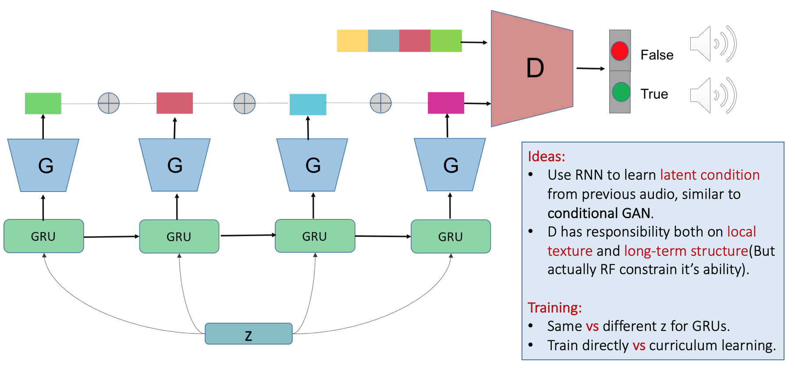

# MusicGAN
This was a previous work I did at NAVER. The motivation for this project is to **generate long-term dependency raw piano audio**. We try to use RNN combining with [WaveGAN](https://arxiv.org/abs/1802.04208) to solve the problem of "long-term dependency". The listenable samples are: https://soundcloud.com/mazzzystar/sets/only-1-discriminator-to-control-both-local-long-term. As it's not a WaveNet-based model, which use dilated conv and generating sample by sample, current the audio quality is not good.

## Architecture
The archicture is as below:

## Current problems
* Audio quality need to be improved.
* As all outputs from `generator` are simply concatenated, there exists a sudden change of phase, so you can hear the noise of every 1 seconds, where two pieces are concatenated.
* The pace of all generated samples are too **fast**. Maybe because of model collapse that the fast pieces can fool the dicriminator.

## TODO
- [ ] Try to improve the implementation of current `WaveGAN` to get better quality of audio.
- [ ] Combine MusicGAN with VQVAE.